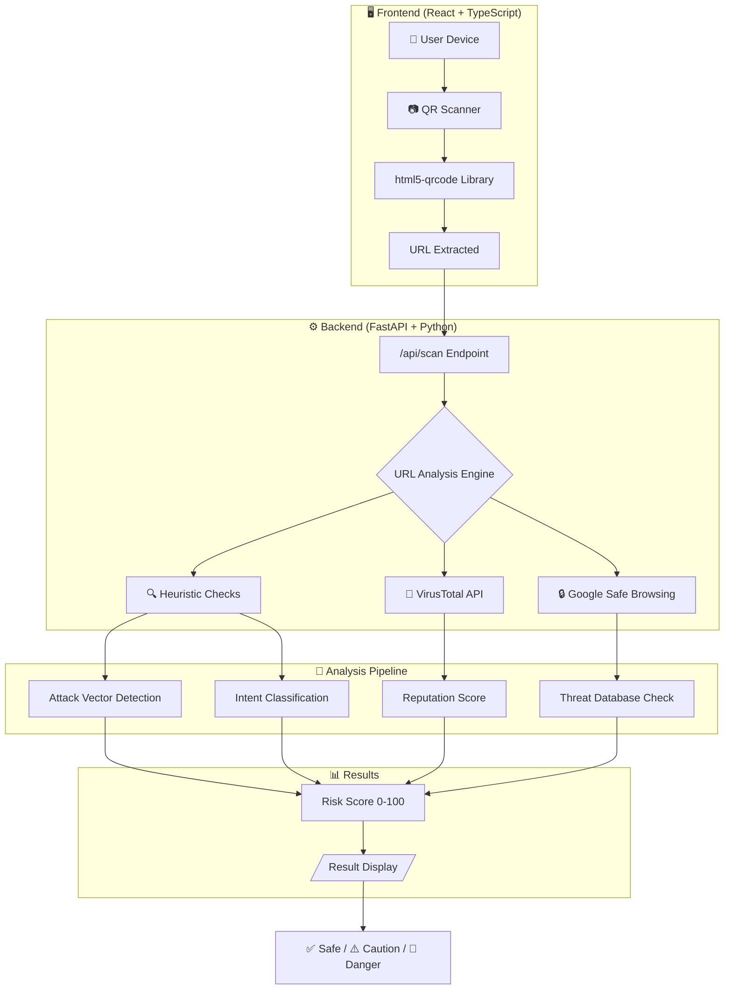
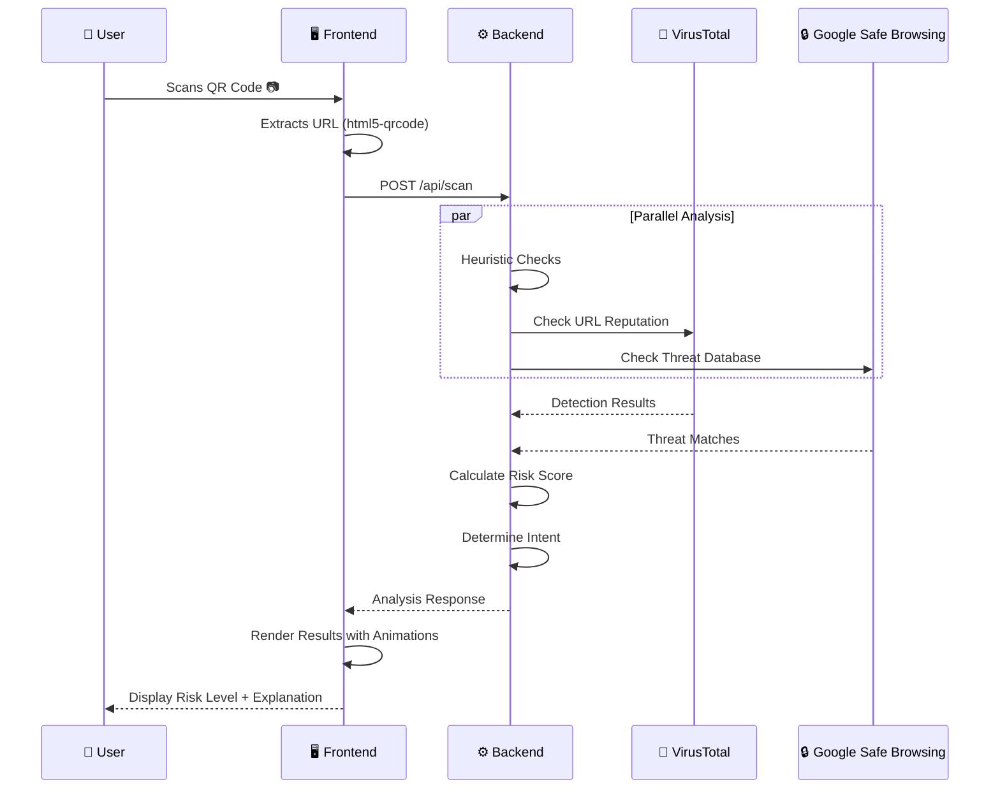

<div align="center">

<!-- Animated Header Banner -->


<!-- Typing Animation -->
<a href="https://git.io/typing-svg"></a>

<br/>

<!-- Badges -->
[](https://safe-scan-lite-cqnf.vercel.app/)
[](/)
[](https://react.dev/)
[](https://fastapi.tiangolo.com/)
[](https://www.typescriptlang.org/)
[](https://vercel.com/)

<br/>

<!-- Quick Stats -->


</div>

---

## 📋 Table of Contents

<details open>
<summary><strong>Click to expand/collapse</strong></summary>

- [🎯 Problem Statement](#-problem-statement)
- [💡 Our Solution](#-our-solution)
- [✨ Key Features](#-key-features)
- [🏗️ System Architecture](#️-system-architecture)
- [🔍 Attack Vector Detection](#-attack-vector-detection)
- [📊 Risk Scoring Algorithm](#-risk-scoring-algorithm)
- [🛠️ Tech Stack](#️-tech-stack)
- [🚀 Live Demo](#-live-demo)
- [📸 Screenshots](#-screenshots)
- [⚙️ Installation & Setup](#️-installation--setup)
- [📡 API Documentation](#-api-documentation)
- [🧪 Test Cases](#-test-cases)
- [📂 Project Structure](#-project-structure)
- [🎬 How It Works](#-how-it-works)
- [🏆 Hackathon Deliverables](#-hackathon-deliverables)
- [🚀 Future Roadmap](#-future-roadmap)
- [👥 Team](#-team)
- [📄 License](#-license)

</details>

---

## 🎯 Problem Statement

<div align="center">

```
╔═══════════════════════════════════════════════════════════════════════════════╗
║                         🚨 THE QUISHING EPIDEMIC 🚨                           ║
╠═══════════════════════════════════════════════════════════════════════════════╣
║                                                                               ║
║   📈 QR code phishing attacks increased by 587% in 2024                       ║
║   💰 Average financial loss per victim: $1,500+                               ║
║   🎯 Most targeted: Non-technical users, elderly, retail customers           ║
║   ⚠️  Problem: QR codes hide malicious URLs in plain sight                   ║
║                                                                               ║
╚═══════════════════════════════════════════════════════════════════════════════╝
```

</div>

**Quishing (QR Phishing)** is a rapidly growing cybersecurity threat where attackers embed malicious URLs in QR codes. Unlike traditional links, users **cannot visually inspect** the destination before scanning, making them extremely vulnerable.

### 🎭 Real-World Attack Scenarios

| Scenario | Attack Method | Potential Damage |
|:---------|:--------------|:-----------------|
| 🅿️ **Parking Meters** | Fake QR codes over legitimate ones | Stolen payment credentials |
| 🍽️ **Restaurant Menus** | Malicious QR redirects to phishing site | Personal data theft |
| 📦 **Package Delivery** | "Track your package" QR leads to malware | Device compromise |
| 🏦 **Bank Notices** | Fake security alerts with QR codes | Financial fraud |

---

## 💡 Our Solution

<div align="center">


</div>

**Safe-Scan Lite** is a user-friendly, web-based security tool that **scans QR codes, analyzes embedded URLs, and explains potential risks in simple, non-technical language**.

### 🌟 What Makes Us Different?

| Feature | Traditional Scanners | **Safe-Scan Lite** |
|:--------|:--------------------|:-------------------|
| **Risk Explanation** | Technical jargon | 👴 Plain English anyone can understand |
| **Intent Detection** | None | 🎯 Identifies attacker's goal |
| **Threat Intelligence** | Basic | 🔗 VirusTotal + Google Safe Browsing |
| **User Experience** | Complex | 🎨 Beautiful, intuitive interface |
| **Transparency** | Black box | 📝 "We checked this so you don't have to" |

---

## ✨ Key Features

<div align="center">

### 🔐 Comprehensive Security Analysis

</div>

<table>
<tr>
<td width="50%">

### 📱 QR Code Scanning
- 📷 **Live Camera Scanning** - Real-time detection
- 📤 **Image Upload** - Support for existing QR images
- ⌨️ **Manual URL Input** - Direct URL analysis
- ⚡ **Instant Results** - Analysis in under 2 seconds

</td>
<td width="50%">

### 🛡️ Threat Detection
- 🔍 **6 Attack Vectors** - Comprehensive coverage
- 🎯 **Intent Guessing** - Understands attacker's goal
- 📊 **Risk Scoring** - 0-100 quantified risk
- 🚦 **Traffic Light System** - Safe/Caution/Danger

</td>
</tr>
<tr>
<td width="50%">

### 🌐 Threat Intelligence
- 🦠 **VirusTotal Integration** - 70+ antivirus engines
- 🔒 **Google Safe Browsing** - Real-time threat database
- 🔄 **Redirect Analysis** - Tracks URL hop chains
- 🌍 **Domain Reputation** - Age & trust signals

</td>
<td width="50%">

### 👥 User Experience
- 📝 **Plain Language** - No tech jargon
- 😊 **Emoji Indicators** - Visual risk cues
- 💡 **"Why You're Targeted"** - Educational insights
- ✅ **Transparency Panel** - Shows what was checked

</td>
</tr>
</table>

---

## 🏗️ System Architecture



---

## 🔍 Attack Vector Detection

Our system detects **6 critical attack vectors** using heuristic analysis:

<table>
<thead>
<tr>
<th align="center">🎯 Attack Vector</th>
<th align="left">📝 Description</th>
<th align="left">🔍 Detection Method</th>
<th align="center">⚠️ Risk Points</th>
</tr>
</thead>
<tbody>
<tr>
<td align="center">🔓 <strong>Unencrypted Connection</strong></td>
<td>HTTP instead of HTTPS</td>
<td>Protocol scheme check</td>
<td align="center"><code>+15</code></td>
</tr>
<tr>
<td align="center">🌐 <strong>IP Address Hosting</strong></td>
<td>Raw IP instead of domain</td>
<td>IPv4/IPv6 regex pattern</td>
<td align="center"><code>+20</code></td>
</tr>
<tr>
<td align="center">📛 <strong>Suspicious TLD</strong></td>
<td>.xyz, .top, .club, .zip, etc.</td>
<td>TLD blacklist matching</td>
<td align="center"><code>+10</code></td>
</tr>
<tr>
<td align="center">🎭 <strong>Typosquatting</strong></td>
<td>g00gle.com, paypa1.com</td>
<td>Brand similarity + char substitution</td>
<td align="center"><code>+30</code></td>
</tr>
<tr>
<td align="center">🔗 <strong>URL Shorteners</strong></td>
<td>bit.ly, tinyurl.com, etc.</td>
<td>Known shortener database</td>
<td align="center"><code>+10</code></td>
</tr>
<tr>
<td align="center">📥 <strong>Malicious Downloads</strong></td>
<td>.apk, .exe file links</td>
<td>Extension pattern matching</td>
<td align="center"><code>+40</code></td>
</tr>
</tbody>
</table>

### 🧠 Intent Classification

Based on detected signals, we classify the likely **attacker intent**:

```
┌─────────────────────────────────────────────────────────────────────┐
│                     INTENT CLASSIFICATION ENGINE                    │
├─────────────────────────────────────────────────────────────────────┤
│                                                                     │
│   🔑 credential_theft      "Trying to steal your login details"    │
│   💰 financial_fraud       "Attempting to steal your money"        │
│   📥 malware_distribution  "Trying to install harmful software"    │
│   📋 data_harvesting       "Collecting your personal information"  │
│   🎣 phishing              "May be hiding a dangerous destination" │
│   ✅ legitimate            "Appears to be a legitimate website"    │
│                                                                     │
└─────────────────────────────────────────────────────────────────────┘
```

---

## 📊 Risk Scoring Algorithm

<div align="center">

```
           Risk Score Calculation
    ─────────────────────────────────────
    
    Base Score = Σ (Attack Vector Points)
    
    + VirusTotal Detection   → +3 × detection_count (max 30)
    + Safe Browsing Threat   → +35
    + Domain Age < 30 days   → +20
    + Redirects > 5          → +10
    
    ─────────────────────────────────────
    Final Score = min(calculated, 100)
```

</div>

### 🚦 Risk Level Thresholds

| Score Range | Level | Indicator | User Guidance |
|:-----------:|:-----:|:---------:|:--------------|
| `0 - 19` | **SAFE** | ✅ Green | Proceed with normal caution |
| `20 - 49` | **CAUTION** | ⚠️ Yellow | Review details before proceeding |
| `50 - 100` | **DANGER** | 🚨 Red | Do NOT visit this URL |

---

## 🛠️ Tech Stack

<div align="center">

### Frontend
[](https://react.dev/)
[](https://www.typescriptlang.org/)
[](https://vitejs.dev/)
[](https://www.framer.com/motion/)

### Backend
[](https://fastapi.tiangolo.com/)
[](https://python.org/)

### APIs & Integrations
[](https://www.virustotal.com/)
[](https://safebrowsing.google.com/)

### Deployment
[](https://vercel.com/)
[](https://render.com/)

</div>

---

## 🚀 Live Demo

<div align="center">

### 👉 [**Try Safe-Scan Lite Now**](https://safe-scan-lite-cqnf.vercel.app/) 👈

<br/>

<a href="https://safe-scan-lite-cqnf.vercel.app/">

</a>

<br/><br/>

**No installation required! Works on any device with a camera.**

</div>

---

## 📸 Screenshots

> **Note:** Replace the placeholder paths below with actual screenshots of your application.

<div align="center">

| Landing Page | Scan Page |
|:------------:|:---------:|
| *Hero section with 3-step explanation* | *Camera-based QR scanning* |

| Analyzing Page | Result Page |
|:--------------:|:-----------:|
| *Animated progress indicators* | *Risk assessment with explanations* |

</div>

---

## ⚙️ Installation & Setup

### Prerequisites

- **Node.js** v16 or higher
- **Python** 3.9 or higher
- **npm** or **yarn**

### 🔧 Backend Setup

```bash
# 1. Navigate to backend directory
cd backend

# 2. Create virtual environment (recommended)
python -m venv venv
source venv/bin/activate  # On Windows: venv\Scripts\activate

# 3. Install dependencies
pip install -r requirements.txt

# 4. Create .env file (optional - for threat intelligence APIs)
cp .env.example .env
# Edit .env and add your API keys:
# VIRUSTOTAL_API_KEY=your_key_here
# GOOGLE_SAFE_BROWSING_API_KEY=your_key_here

# 5. Run the server
uvicorn main:app --reload --host 0.0.0.0 --port 8000
```

Backend runs at: `http://localhost:8000`

### 🎨 Frontend Setup

```bash
# 1. Navigate to frontend directory
cd frontend

# 2. Install dependencies
npm install

# 3. Start development server
npm run dev
```

Frontend runs at: `http://localhost:5173`

### 🔑 API Keys (Optional but Recommended)

For enhanced threat detection, configure these API keys:

| API | Purpose | Get Key |
|:----|:--------|:--------|
| **VirusTotal** | Malware/phishing detection | [virustotal.com](https://www.virustotal.com/gui/join-us) |
| **Google Safe Browsing** | Real-time threat database | [Google Cloud Console](https://console.cloud.google.com/) |

> ⚠️ The application works without API keys but with reduced threat intelligence capabilities.

---

## 📡 API Documentation

### Base URL
```
Production: https://your-backend-url.onrender.com
Local: http://localhost:8000
```

### Endpoints

#### 🔍 POST `/api/scan`

Analyze a URL for security threats.

<details>
<summary><strong>📥 Request</strong></summary>

```json
{
  "qr_content": "https://example.com"
}
```

</details>

<details>
<summary><strong>📤 Response</strong></summary>

```json
{
  "status": "success",
  "risk": {
    "level": "danger",
    "score": 82
  },
  "intent": {
    "code": "credential_theft",
    "label": "Trying to steal your login details"
  },
  "signals": {
    "short_url": true,
    "brand_impersonation": true,
    "payment_request": false,
    "apk_download": false,
    "http_only": true,
    "domain_age_days": 3,
    "redirect_count": 2
  },
  "reputation": {
    "virustotal_detected": true,
    "virustotal_score": 12,
    "safe_browsing_threat": true,
    "threat_types": ["MALWARE", "SOCIAL_ENGINEERING"],
    "checked_by": ["VirusTotal", "Google Safe Browsing"]
  },
  "safe_preview": {
    "final_domain": "paytm-secure-login.xyz",
    "https": false,
    "content_type": "login_page",
    "country": "Unknown",
    "file_download": false
  },
  "checked_items": [
    "URL shortener detection",
    "Redirect behavior",
    "HTTPS encryption",
    "Brand impersonation",
    "Payment requests",
    "File downloads",
    "Domain reputation",
    "Known scam databases"
  ]
}
```

</details>

#### ❤️ GET `/api/health`

Health check endpoint.

```json
{
  "status": "ok",
  "service": "safe-scan-lite"
}
```

### 📚 Interactive Docs

Visit `http://localhost:8000/docs` for Swagger UI documentation.

---

## 🧪 Real Test Cases (With QR Codes)

We have tested Safe-Scan Lite with **7 different attack scenarios**. Each test case includes the QR code, the embedded URL, and the scanner's analysis output.

<div align="center">

### 🔬 Test Your Own!

*Scan these QR codes with Safe-Scan Lite to see the security analysis in action!*

</div>

---

### 1️⃣ Phishing Attack (Brand Impersonation)

<table>
<tr>
<td width="200" align="center">

**QR Code**

.png)

</td>
<td>

**URL:** `https://paytm-secure-login.example/auth`

**🎯 Attack Type:** Credential Theft via Brand Impersonation

</td>
</tr>
</table>

<details>
<summary><strong>📊 Expected Output</strong></summary>

```json
{
  "risk": {
    "level": "danger",
    "score": 65
  },
  "intent": {
    "code": "credential_theft",
    "label": "Trying to steal your login details"
  },
  "signals": {
    "brand_impersonation": true,
    "http_only": false,
    "payment_request": false
  },
  "detection_reasons": [
    "🚨 Domain mimics 'Paytm' - likely a phishing attempt!",
    "⚠️ URL contains suspicious keywords: 'login', 'secure', 'auth'"
  ]
}
```

</details>

---

### 2️⃣ URL Shortener (Hidden Destination)

<table>
<tr>
<td width="200" align="center">

**QR Code**

.png)

</td>
<td>

**URL:** `https://bit.ly/example-login`

**🎯 Attack Type:** Obfuscated Malicious Link

</td>
</tr>
</table>

<details>
<summary><strong>📊 Expected Output</strong></summary>

```json
{
  "risk": {
    "level": "caution",
    "score": 35
  },
  "intent": {
    "code": "phishing",
    "label": "May be hiding a dangerous destination"
  },
  "signals": {
    "short_url": true,
    "redirect_count": 1
  },
  "detection_reasons": [
    "⚠️ URL uses a shortener service (bit.ly) - final destination unknown",
    "⚠️ Shortened URLs can hide malicious destinations"
  ]
}
```

</details>

---

### 3️⃣ Payment / UPI Fraud

<table>
<tr>
<td width="200" align="center">

**QR Code**

.png)

</td>
<td>

**URL:** `upi://pay?pa=scammer@upi&pn=RefundService&am=500`

**🎯 Attack Type:** Financial Fraud via Fake UPI Payment

</td>
</tr>
</table>

<details>
<summary><strong>📊 Expected Output</strong></summary>

```json
{
  "risk": {
    "level": "danger",
    "score": 75
  },
  "intent": {
    "code": "financial_fraud",
    "label": "Attempting to steal your money"
  },
  "signals": {
    "payment_request": true,
    "brand_impersonation": false
  },
  "detection_reasons": [
    "🚨 This is a UPI payment request - money will be DEDUCTED, not credited!",
    "⚠️ 'RefundService' is a common scam name - refunds never require you to pay",
    "💰 Amount: ₹500 would be sent to 'scammer@upi'"
  ]
}
```

</details>

---

### 4️⃣ Malware / APK Download

<table>
<tr>
<td width="200" align="center">

**QR Code**

.png)

</td>
<td>

**URL:** `https://secure-update.example/app_update.apk`

**🎯 Attack Type:** Malware Distribution via Fake App Update

</td>
</tr>
</table>

<details>
<summary><strong>📊 Expected Output</strong></summary>

```json
{
  "risk": {
    "level": "danger",
    "score": 85
  },
  "intent": {
    "code": "malware_distribution",
    "label": "Trying to install harmful software"
  },
  "signals": {
    "apk_download": true,
    "brand_impersonation": true
  },
  "safe_preview": {
    "file_download": true,
    "content_type": "executable_download"
  },
  "detection_reasons": [
    "🚨 DANGER: This link downloads an APK file!",
    "⚠️ APK files from unknown sources can contain malware",
    "⚠️ 'secure-update' is a fake domain - legitimate apps update through Play Store"
  ]
}
```

</details>

---

### 5️⃣ Insecure HTTP Connection

<table>
<tr>
<td width="200" align="center">

**QR Code**

.png)

</td>
<td>

**URL:** `http://account-verification.example/login`

**🎯 Attack Type:** Credential Theft via Insecure Connection

</td>
</tr>
</table>

<details>
<summary><strong>📊 Expected Output</strong></summary>

```json
{
  "risk": {
    "level": "danger",
    "score": 60
  },
  "intent": {
    "code": "credential_theft",
    "label": "Trying to steal your login details"
  },
  "signals": {
    "http_only": true,
    "brand_impersonation": true
  },
  "safe_preview": {
    "https": false,
    "content_type": "login_page"
  },
  "detection_reasons": [
    "🔓 Connection is NOT secure (HTTP) - attackers can intercept your data",
    "⚠️ Legitimate login pages always use HTTPS",
    "⚠️ URL contains suspicious keywords: 'verification', 'login', 'account'"
  ]
}
```

</details>

---

### 6️⃣ Malicious App Intent

<table>
<tr>
<td width="200" align="center">

**QR Code**

.png)

</td>
<td>

**URL:** `intent://scan;#intent;scheme=bankapp;package=com.fake.bank;end`

**🎯 Attack Type:** Fake Banking App Deep Link Attack

</td>
</tr>
</table>

<details>
<summary><strong>📊 Expected Output</strong></summary>

```json
{
  "risk": {
    "level": "danger",
    "score": 80
  },
  "intent": {
    "code": "credential_theft",
    "label": "Trying to steal your login details"
  },
  "signals": {
    "brand_impersonation": true,
    "apk_download": false
  },
  "detection_reasons": [
    "🚨 This is an Android Intent URL - tries to open an app directly!",
    "⚠️ Package 'com.fake.bank' is NOT a legitimate banking app",
    "⚠️ Attackers use intent URLs to bypass security checks"
  ]
}
```

</details>

---

### 7️⃣ ✅ Safe Website (Legitimate)

<table>
<tr>
<td width="200" align="center">

**QR Code**

.png)

</td>
<td>

**URL:** `https://nu.acm.org/`

**✅ Type:** Legitimate Organization Website (NU ACM)

</td>
</tr>
</table>

<details>
<summary><strong>📊 Expected Output</strong></summary>

```json
{
  "risk": {
    "level": "safe",
    "score": 0
  },
  "intent": {
    "code": "legitimate",
    "label": "Appears to be a legitimate website"
  },
  "signals": {
    "short_url": false,
    "brand_impersonation": false,
    "payment_request": false,
    "apk_download": false,
    "http_only": false
  },
  "safe_preview": {
    "https": true,
    "final_domain": "nu.acm.org",
    "content_type": "webpage"
  },
  "detection_reasons": [
    "✅ Connection is secure (HTTPS)",
    "✅ Domain belongs to ACM (Association for Computing Machinery)",
    "✅ No suspicious patterns detected"
  ]
}
```

</details>

---

### 📋 Test Cases Summary Table

| # | Attack Type | URL | Risk Level | Risk Score |
|:-:|:------------|:----|:----------:|:----------:|
| 1 | 🎣 **Phishing** | `paytm-secure-login.example/auth` | 🚨 DANGER | 65 |
| 2 | 🔗 **URL Shortener** | `bit.ly/example-login` | ⚠️ CAUTION | 35 |
| 3 | 💰 **UPI Fraud** | `upi://pay?pa=scammer@upi...` | 🚨 DANGER | 75 |
| 4 | 📥 **Malware/APK** | `secure-update.example/app_update.apk` | 🚨 DANGER | 85 |
| 5 | 🔓 **Insecure HTTP** | `http://account-verification.example/login` | 🚨 DANGER | 60 |
| 6 | 📱 **App Intent** | `intent://scan;#intent;scheme=bankapp...` | 🚨 DANGER | 80 |
| 7 | ✅ **Safe Website** | `https://nu.acm.org/` | ✅ SAFE | 0 |

---

## 📂 Project Structure

```
Safe-Scan-Lite/
│
├── 📁 frontend/                    # React Frontend Application
│   ├── 📁 src/
│   │   ├── 📁 pages/
│   │   │   ├── LandingPage.tsx    # Hero & introduction
│   │   │   ├── ScanPage.tsx       # QR scanner interface
│   │   │   ├── AnalyzingPage.tsx  # Loading/progress screen
│   │   │   ├── ResultPage.tsx     # Risk analysis display
│   │   │   ├── LearnPage.tsx      # Educational content
│   │   │   └── ErrorPage.tsx      # Error handling
│   │   ├── 📁 components/         # Reusable UI components
│   │   ├── App.tsx                # Main app with routing
│   │   └── index.css              # Global styles
│   ├── package.json
│   └── vite.config.ts
│
├── 📁 backend/                     # FastAPI Backend
│   ├── main.py                    # API endpoints & analysis logic
│   ├── requirements.txt           # Python dependencies
│   ├── .env.example               # Environment template
│   └── test_backend.py            # Test suite
│
├── vercel.json                    # Frontend deployment config
├── render.yaml                    # Backend deployment config
└── README.md                      # This file
```

---

## 🎬 How It Works

<div align="center">



</div>

### Step-by-Step Flow

1. **📷 QR Scan** - User scans QR code using camera or uploads image
2. **🔍 URL Extraction** - Frontend extracts embedded URL using html5-qrcode
3. **📡 API Request** - URL sent to FastAPI backend for analysis
4. **🧠 Heuristic Analysis** - 6 attack vectors checked locally
5. **🌐 Threat Intelligence** - VirusTotal + Google Safe Browsing APIs queried
6. **📊 Risk Calculation** - Weighted score computed (0-100)
7. **🎯 Intent Classification** - Attacker's likely goal determined
8. **📝 Plain Language** - Technical findings translated to simple explanations
9. **✨ Result Display** - Animated results with clear risk indicators

---

## 🏆 Hackathon Deliverables

<table>
<tr>
<td>✅</td>
<td><strong>Functional Web Tool</strong></td>
<td>Live QR scanner with real-time analysis</td>
</tr>
<tr>
<td>✅</td>
<td><strong>Attack Vector Detection</strong></td>
<td>6 heuristic-based detection methods</td>
</tr>
<tr>
<td>✅</td>
<td><strong>Risk Scoring System</strong></td>
<td>Quantified 0-100 risk score algorithm</td>
</tr>
<tr>
<td>✅</td>
<td><strong>Threat Intelligence</strong></td>
<td>VirusTotal & Google Safe Browsing integration</td>
</tr>
<tr>
<td>✅</td>
<td><strong>User-Friendly UX</strong></td>
<td>Plain language explanations with emoji indicators</td>
</tr>
<tr>
<td>✅</td>
<td><strong>Deployed Demo</strong></td>
<td>Live on Vercel: <a href="https://safe-scan-lite-cqnf.vercel.app/">safe-scan-lite-cqnf.vercel.app</a></td>
</tr>
<tr>
<td>✅</td>
<td><strong>Source Code</strong></td>
<td>Complete GitHub repository with documentation</td>
</tr>
<tr>
<td>✅</td>
<td><strong>API Documentation</strong></td>
<td>Swagger UI + detailed endpoint docs</td>
</tr>
</table>

---

## 🚀 Future Roadmap

<div align="center">

```
     Q1 2025                Q2 2025                Q3 2025                Q4 2025
        │                      │                      │                      │
   ┌────┴────┐            ┌────┴────┐            ┌────┴────┐            ┌────┴────┐
   │  v1.1   │            │  v1.2   │            │  v2.0   │            │  v2.5   │
   │ Browser │            │   ML    │            │ Mobile  │            │Enterprise│
   │Extension│            │ Model   │            │  App    │            │ Version │
   └─────────┘            └─────────┘            └─────────┘            └─────────┘
        │                      │                      │                      │
   • Chrome/Firefox       • Neural network       • React Native         • API for
   • Edge support         • Improved accuracy    • iOS & Android          businesses
   • Context menu         • Auto-learning        • Offline mode         • Dashboard
```

</div>

### Upcoming Features

- [ ] 🌐 **Browser Extension** - One-click scanning from any webpage
- [ ] 🤖 **ML-Based Detection** - Train model on real phishing data
- [ ] 📱 **Mobile Apps** - Native iOS and Android applications
- [ ] 📶 **WiFi QR Security** - Analyze WiFi network QR codes
- [ ] 🗣️ **Multi-language** - Support for 10+ languages
- [ ] 📊 **Analytics Dashboard** - Track scan history and trends

---

## 👥 Team

<div align="center">

**Created for Cybersecurity & Privacy Hackathon Domain**

*Building tools to make the digital world safer for everyone* 🌍

</div>

---

## 📄 License

<div align="center">

MIT License - Free to use for hackathons, education, and non-commercial purposes.

</div>

---

## 🙏 Acknowledgments

- 📚 Research based on latest quishing attack studies (2024-2025)
- 🛡️ VirusTotal for threat intelligence API
- 🔒 Google Safe Browsing for real-time threat data
- 💡 Inspired by real-world security needs

---

<div align="center">

<!-- Animated Footer -->


<br/>

<a href="https://safe-scan-lite-cqnf.vercel.app/">

</a>

<br/><br/>

**Made with ❤️ for a safer digital world**

<br/>

[](/)

</div>
